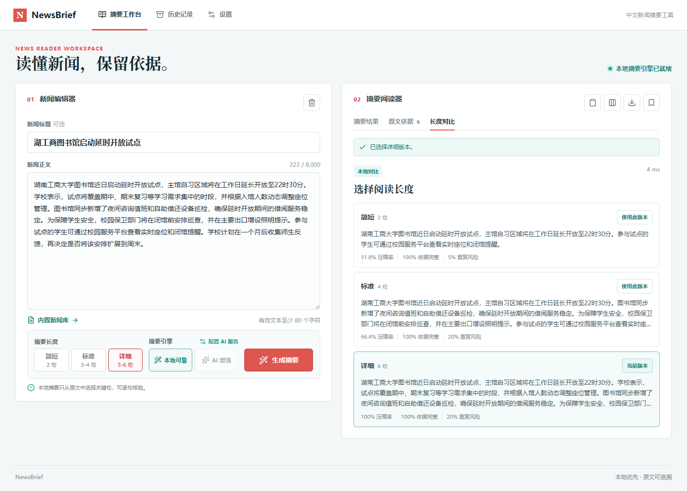

# NewsBrief 中文新闻摘要工作台

NewsBrief 是一个面向中文新闻阅读场景的本地优先摘要工具。用户粘贴新闻标题与正文后，可获得可追溯的抽取式摘要、要点、关键词和原文依据；也可在本地比较简短、标准、详细三种摘要长度，再决定复制、导出或保存的版本。

项目定位为高质量课程实训作品：核心能力可以在无网络、未配置 AI 密钥的环境中完整运行，适合本地展示、课程验收与后续维护。



## 核心功能

- 新闻链接导入：支持粘贴公开 HTTPS 新闻报道页，使用元数据、Schema.org JSON-LD、前端框架内嵌数据、常见新闻正文容器与段落回退提取标题和正文后回填至可编辑工作台；兼容 UTF-8、GB18030/GBK 与 Big5 等常见编码。用户确认后才会生成摘要，来源链接可随历史、备份与导出保留。支持央视网等将正文安全内嵌在静态 HTML 变量中的页面；图片、视频直链和 MSN 等动态装配页会明确提示改用原始报道链接或手动粘贴文字稿。
- 新闻感知本地摘要：融合 PageRank、标题相关度、导语位置和数字事实信号，并使用 MMR 抑制重复。
- 六要素新闻事实：展示主体、时间、地点、核心事件、关键数值和影响/后续；每项均可定位原文依据。
- 可协作证据链：本地模式支持固定重要句、排除无关句，并在约束下重新生成摘要和长度对比。
- 三档长度对比：一次文本分析生成简短（2 句）、标准（3-4 句）和详细（5-6 句）结果，不重复计算，也不写入历史。
- 原文可追溯：每个本地摘要句和要点都保留原文句索引，可在“原文依据”中定位与高亮。
- 质量反馈：显示依据完整度、重复风险、压缩率、关键句规模与处理耗时，不把摘要误标为绝对正确。
- 完整阅读流程：内置原创样例、复制、文本导出、本地历史、搜索、收藏、评分、恢复和删除。
- 本机历史备份：一键导出完整 JSON 备份，并可安全导入合并；重复内容自动跳过，不覆盖现有记录。
- 可选 AI 增强：兼容 DeepSeek/OpenAI 风格接口；配置失败、超时或依据不合格时自动回退本地摘要。
- 核验线索：从本地事实构造带原文索引的可核验主张；可选使用公开来源交叉检索，只显示证据状态，不判定新闻真伪。
- AI 辅助证据解读：用户主动调用后，AI 只分析已获取的来源短摘录并引用来源编号；规则状态仍是正式证据状态。
- 响应式工作台：960px 以上使用双栏；720px 至 959px 使用上下阅读；手机端为单列触控布局，并随浏览器可用宽度自动切换。
- 算法与质量说明：作为页脚辅助入口，说明可复现评测方法、指标定义和数据边界；不干扰普通用户的摘要工作流，也不判断单条新闻真伪。

## 技术方案

| 层级       | 技术                                                         |
| ---------- | ------------------------------------------------------------ |
| 前端       | Vue 3、TypeScript、Vite、Vue Router、Pinia、Lucide、原生 CSS |
| 后端       | FastAPI、Pydantic、Uvicorn、SQLAlchemy、SQLite               |
| 本地摘要   | jieba、scikit-learn TF-IDF、networkx PageRank、MMR           |
| 自动化验证 | pytest、Vitest、真实浏览器响应式验收                         |

本地算法会先清洗文本并进行中文分句，再构建句子 TF-IDF 向量与相似度图，通过 PageRank 得到基础重要性。最终排序分数由 70% PageRank、14% 标题相关度、10% 导语位置和 6% 数字事实组成；没有标题时，标题权重会并入 PageRank。选句阶段使用 MMR 控制重复，并按原文顺序输出。

## 项目结构

```text
NewsBrief/
├─ backend/                    FastAPI 接口、摘要算法、SQLite 与测试
│  ├─ summarizer.py            新闻感知本地摘要与长度对比
│  ├─ facts.py                 六要素事实提取与事实覆盖度量
│  ├─ benchmarks.py            本地私有评测集运行器
│  ├─ verification.py          离线主张、公开来源检索与证据匹配
│  ├─ main.py                  API、AI 校验与历史记录
│  └─ tests/                   后端自动化测试
├─ src/                        Vue 工作台、状态管理与页面样式
│  ├─ views/                   摘要、历史、设置页面
│  └─ stores/                  摘要与历史工作流状态
├─ docs/                       报告素材、架构说明与验收截图
│  ├─ evaluation/              评测数据规范、公开元数据结构
│  └─ competition/             演示脚本、海报结构与答辩问题库
├─ public/                     静态资源
└─ package.json                前端命令与依赖
```

## 本地运行

### 1. 环境准备

推荐使用 Node.js 24 与 Python 3.13。首次运行时，在项目根目录执行：

```powershell
python -m venv .venv
.\.venv\Scripts\Activate.ps1
python -m pip install -r backend\requirements.txt
npm install
```

### 2. 启动服务

在第一个 PowerShell 窗口启动后端：

```powershell
python -m uvicorn backend.main:app --host 127.0.0.1 --port 8000
```

在第二个 PowerShell 窗口启动前端：

```powershell
npm run dev -- --host 127.0.0.1 --port 5173
```

浏览器访问 `http://127.0.0.1:5173`。前端会将 `/api` 请求转发到本机 `8000` 端口的后端服务。

### 3. 单机离线演示

完成一次构建后，FastAPI 会自动托管 `dist/` 静态页面。竞赛现场只需启动一个本机服务：

```powershell
npm run build
python -m uvicorn backend.main:app --host 127.0.0.1 --port 8000
```

浏览器访问 `http://127.0.0.1:8000`。摘要、事实卡、证据协作、历史和评测说明均可离线展示；AI 仅作为有网络和密钥时的附加能力。

## 可选 AI 增强

本地摘要不需要 API Key。需要 AI 增强时，在应用的“设置”页面填写 API Key、Base URL 和模型名称，先点击“测试连接”，确认服务可用后再保存配置。

- 默认兼容 DeepSeek：`https://api.deepseek.com` 与 `deepseek-chat`。
- API Key 仅保存在本机 `backend/.env`，不会返回浏览器、写入 SQLite 历史、写入日志或出现在导出文件中。
- AI 输出必须通过 JSON 结构与原文索引校验；任何异常都会回退到本地可靠摘要。

可参考 [backend/.env.example](backend/.env.example) 的配置项。不要把真实的 `backend/.env` 提交到公开仓库。

## 公开来源核验

“核验线索”是新闻核验辅助，不会给新闻贴上“真”或“假”的标签。摘要生成后，系统会先根据已提取的主体、时间、地点、事件、数值和影响生成带原文句索引的离线主张；即使未联网，这些主张也可以用于回看输入内容。

如需主动检索公开来源，在“设置”页面选择搜索服务、填写对应 API Key，先测试连接，再显式保存。新配置默认使用博查 Web Search，适合中文新闻来源发现；Brave Search 保留为国际来源可选项。联网核验只向搜索服务发送由主体、事件、时间或数值组合而成的短查询，不发送整篇新闻正文。系统只接受 HTTPS 公开地址，并限制查询数量、来源数量、跳转次数、响应大小和总耗时；远程网页全文不会写入 SQLite 历史。

结果仅可能显示：`已支持`、`部分支持`、`待补充`、`存在冲突`、`未联网核验`。其中证据状态反映“公开来源对该主张的覆盖情况”，不等同于新闻真实性结论。未配置 Key、网络不可用或检索失败时，系统会安全保留离线主张和其他全部摘要功能。

完成联网核验后，可单独点击“AI 解读证据”。该操作沿用既有 DeepSeek/OpenAI 兼容 AI 配置，只发送当前主张和最多 6 条来源的标题、域名、等级与短摘录；不会发送新闻正文、完整网页或密钥。AI 建议必须引用当前来源编号，始终与规则状态并列显示，不能搜索网络、覆盖规则结论或判定新闻真伪。

## 接口概览

| 接口                                | 用途                                                        |
| ----------------------------------- | ----------------------------------------------------------- |
| `POST /api/summaries`               | 生成单份本地或 AI 增强摘要                                  |
| `POST /api/articles/import`         | 安全提取公开 HTTPS 新闻页的标题与正文，不自动摘要或写入历史 |
| `POST /api/summaries/compare`       | 返回本地三档摘要对比，不调用 AI、不保存历史                 |
| `GET /api/samples`                  | 获取六篇原创演示新闻                                        |
| `GET /api/history`                  | 查询本机历史记录，支持搜索与排序                            |
| `GET /api/history/backup`           | 导出全部本机历史记录的 JSON 备份                            |
| `POST /api/history/import`          | 校验并合并导入历史备份，跳过重复内容                        |
| `PATCH /api/history/{id}`           | 更新收藏与评分                                              |
| `DELETE /api/history/{id}`          | 删除单条或清空历史                                          |
| `GET /api/capabilities`             | 获取本地与 AI 引擎状态                                      |
| `PUT /api/search-config`            | 保存本机博查或 Brave 公开来源检索配置                       |
| `POST /api/search-config/verify`    | 测试尚未保存的公开来源检索配置                              |
| `POST /api/verifications`           | 返回离线主张或用户主动发起的联网核验结果                    |
| `POST /api/verifications/ai-review` | 基于现有来源短摘录生成 AI 建议，不触发搜索                  |
| `GET /api/benchmarks/overview`      | 获取公开的评测方法与私有数据状态                            |
| `POST /api/benchmarks/run`          | 使用本机私有测试集运行评测，不写入历史                      |

## 测试与构建

```powershell
# 后端测试
python -m pytest backend/tests -q

# 前端状态测试
npm run test:frontend

# 代码格式检查
npm run format:check

# 静态检查
npm run lint
npm run lint:backend

# 生产构建
npm run build
```

当前 V2.5.0 课程交付验收结果：后端 49 项测试、前端 11 项测试、Ruff、ESLint、Prettier 与生产构建均已通过；真实浏览器在 1440px 和 375px 下复验了工作台、链接提示和“算法与质量说明”入口，均无横向溢出；实际央视网公开链接可导入标题与正文。公开来源的真实联网核验需要用户自行配置有效博查或 Brave Key，AI 解读也需要用户主动配置有效 AI Key；项目不会伪造在线来源、模型建议或真实性结论。算法与质量说明目前提供评测框架与方法说明，不宣称未完成的真实评测结论。

## 开发规范

提交前依次执行 `npm run format:check`、`npm run lint`、`npm run lint:backend`、`npm run test:backend`、`npm run test:frontend` 与 `npm run build`。前端格式由 Prettier 统一，Python 使用 Ruff 和 `.editorconfig` 的四空格缩进。功能、接口或用户可见行为变更时，同时更新 [更新记录](CHANGELOG.md) 与 [报告素材](docs/项目开发与报告素材.md)。

## 数据与隐私边界

- SQLite 只保存用户主动点击“保存历史”的本机内容，数据库文件为 `backend/newsbrief.db`。
- 新闻链接导入只读取用户主动提交的公开 HTTPS 新闻报道页；系统只解析返回的静态 HTML 与静态数据块，不会执行第三方页面脚本。远程网页全文不会写入 SQLite、JSON 备份或 Git 仓库，用户保存历史时仅保留原始链接与域名。图片、视频等直接资源链接不提取，MSN 等依赖浏览器脚本装配正文的页面会提示使用原始发布媒体链接，避免把非正文或不完整内容伪装为新闻文本。
- 历史备份由用户手动导出为 JSON 文件；导入只合并新记录，备份不包含 API Key 或远程网页全文。
- 本地模式不需要网络；最终答辩可直接使用本地摘要完成完整流程。
- 项目不包含新闻爬虫、批量链接导入、账号体系、云端同步、批量处理、模型训练或多媒体摘要；新闻链接导入仅用于用户主动提交的单篇公开页面。
- 后续接入私有评测数据时，新闻正文快照、人工标注和原始评分应保留在 `backend/benchmark_private/`，不会提交。

## 课程提交检查

- 使用 `npm run test`、`npm run lint`、`npm run lint:backend` 和 `npm run format:check` 完成代码验收。
- 使用内置原创样例演示“输入新闻 - 生成摘要 - 查看事实与原文依据 - 长度对比 - 保存与恢复历史”的完整离线流程。
- 报告正文优先使用 [项目开发与报告素材](docs/项目开发与报告素材.md) 中已验证的技术说明和测试记录；不要将 AI 建议或公开来源核验写成新闻真伪裁决。
- API Key、`backend/.env`、`backend/newsbrief.db`、构建产物和缓存已在 `.gitignore` 中排除，提交前再次检查 `git status`。

## 报告与截图素材

- [项目开发与报告素材](docs/项目开发与报告素材.md)：需求分析、技术选型、算法说明、接口设计、测试表和版本复盘。
- [截图目录](docs/screenshots/)：桌面、平板、手机与长度对比的验收截图。

## License

本项目采用 [MIT License](LICENSE)。第三方新闻正文、私有评测集、API Key 和本机历史数据不包含在开源仓库中。
